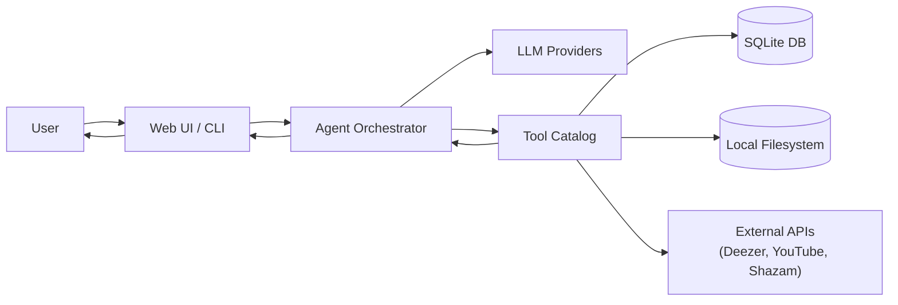
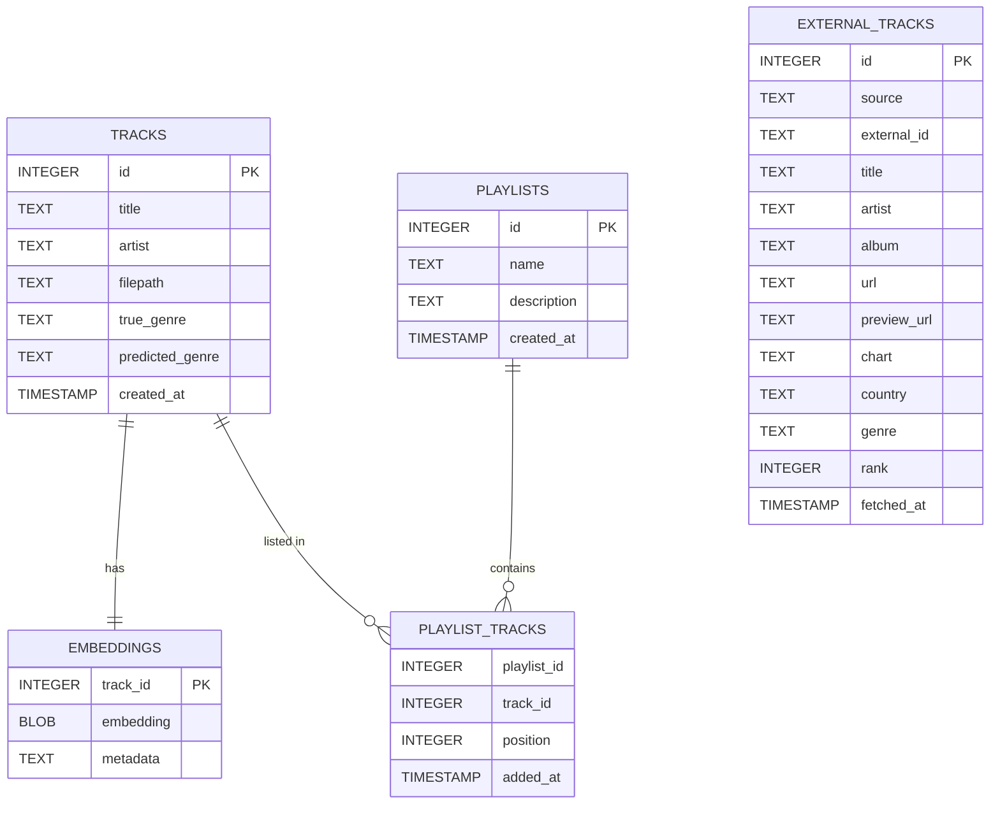

M2 DATA SCIENCE - NOAH HERWEDE & LAIFA AHMED-YAHIA

# Music Agent 

Music Agent  is a tool-using AI system for music library analysis. It connects a Large Language Model (LLM) to a modular set of Python tools that do the real work: audio feature extraction, similarity search, report generation, conversion, and external data retrieval. The LLM orchestrates tool selection and composes the final response, but it does not invent data.

This repository is designed for local use first, with an optional web UI. It includes a SQLite database for persistence, a structured file layout for outputs, and multiple LLM providers.

## Highlights

- Analyze a local music library (tempo, energy, genre distribution, highlights).
- Find similar tracks using embeddings.
- Generate track and library reports (Markdown + HTML + plots).
- Create waveform/spectrogram visualizations.
- Convert audio formats (FFmpeg-backed).
- Identify tracks (Shazam) and tag audio.
- Fetch external trends (Deezer).
- Download audio from YouTube and ingest it.
- Build and manage playlists in the local database.

## How it works

The system is split into three layers:

1) Interfaces
   - Web UI (Flask) and CLI accept natural-language requests and file uploads.

2) Agent (Orchestrator)
   - Sends the user request to the LLM with a strict tool schema.
   - Receives tool calls as JSON.
   - Executes tools and formats results.
   - Adds brief commentary without inventing facts.

3) Tools (Python functions)
   - Perform database queries, audio analysis, visualization, and API calls.
   - Each tool is modular and composable.

## Architecture diagram



## Database schema



## Files and directories

```
music_agent_pro/
  src/
    agent.py
    agent_tools/
      analysis.py
      api_clients.py
      converter.py
      database.py
      deezer.py
      reports.py
      shazam.py
      tagger.py
      tts.py
      visualization.py
      youtube.py
  scripts/
    server.py
    cli.py
    setup_database.py
  data/
    raw/
      gtzan/
      youtube/
    uploads/
    processed/
      converted/
      reports/
        plots/
          tracks/
          waveforms/
      tts/
      music_library.db
  config/
    config.yaml
  requirements.txt
  README.md
```

## Tool catalog (LLM-exposed)

Library and analysis:
- analyze_library
- recommend_tracks
- compare_tracks
- find_by_mood
- filter_by_tempo

Reports and visualization:
- generate_report (track or library scope)
- generate_waveform

Audio processing:
- convert_audio
- detect_genre
- tag_audio
- identify_track
- analyze_upload
- save_upload

External sources:
- get_music_trends (Deezer)
- download_youtube_audio

Playlists:
- generate_playlist
- create_playlist
- list_playlists
- get_playlist
- add_to_playlist
- remove_from_playlist
- delete_playlist

## Requirements

- Python 3.10+ recommended.
- FFmpeg (required for conversions and some analysis backends).
- Optional LLM API keys:
  - GROQ_API_KEY
  - OPENAI_API_KEY
  - ANTHROPIC_API_KEY
- Local model (optional): Ollama.

LLM auto-detection order (if multiple are configured): Groq, Ollama, OpenAI, Anthropic.

## Quickstart

```bash
python -m venv .venv
.\.venv\Scripts\activate
pip install -r requirements.txt
python scripts/setup_database.py --db-only
python scripts/server.py
```

Open `http://localhost:5000`.

## Installation and setup

### 1) Create a virtual environment

```bash
python -m venv .venv
. .venv/bin/activate  # Linux/macOS
.\.venv\Scripts\activate  # Windows PowerShell
```

### 2) Install dependencies

```bash
pip install -r requirements.txt
```

### 3) Install FFmpeg

- macOS: `brew install ffmpeg`
- Linux: `sudo apt-get install ffmpeg`
- Windows: install via Chocolatey/Scoop or official builds

### 4) Configure LLMs (optional)

Set one of the following environment variables:

- GROQ_API_KEY
- OPENAI_API_KEY
- ANTHROPIC_API_KEY

For local usage:

```bash
ollama pull llama3.2:3b
```
don't forget to to initialise the model  after dl
If you have a `.env.example`, copy it to `.env` and fill in your keys.

## Database initialization

```bash
python scripts/setup_database.py --db-only
```

Optional: ingest the GTZAN dataset

1) Download and unzip into `data/raw/gtzan/`
2) Run:

```bash
python scripts/setup_database.py
```

## Running the application

### Web UI

```bash
python scripts/server.py
```

Open `http://localhost:5000`.

### CLI

```bash
python scripts/cli.py
```

## Example usage

- "Analyze my library and generate a full report."
- "Find similar tracks to track 12 and build a workout playlist."
- "Download from YouTube and generate a track report."
- "With the uploaded file, detect genre and tag audio."
- "Convert this file to wav and save it."

## Demo flow (crescendo)

1) Library overview
2) Waveform preview
3) Track report
4) Full library report
5) Audio conversion
6) Deezer trends
7) Similarity search or playlist generation

## Outputs and artifacts

- Reports: `data/processed/reports/` (Markdown + HTML + plots)
- Conversions: `data/processed/converted/`
- TTS audio: `data/processed/tts/`
- YouTube downloads: `data/raw/youtube/`

## How to clone and run

```bash
git clone <your-repo-url>
cd music_agent_pro
python -m venv .venv
.\.venv\Scripts\activate
pip install -r requirements.txt
python scripts/setup_database.py --db-only
python scripts/server.py
```

## Troubleshooting

- "No music library data found": ensure `data/processed/music_library.db` exists and has tracks.
- Report errors on missing files: ensure track filepaths are valid on your machine.
- Conversions fail: verify FFmpeg is installed and available in PATH.
- LLM stuck on "Loading": check `/api/llms` response and API keys.

## Notes

- Deezer trends can be saved into `external_tracks` and optionally mapped into `tracks` using synthetic filepaths.
- Tools requiring local audio reject non-local or synthetic paths.
- The LLM is constrained to call tools first for data-dependent requests.

## License

MIT License
